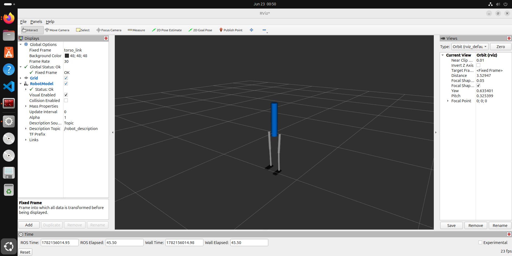

# 🤖 Closed-Loop Humanoid Biped Simulation in ROS 2 Jazzy

A lightweight, math-driven **Kinematic Gait Engine** with an adaptive balance controller for a 7-link humanoid robot, built using **ROS 2 Jazzy** and visualized in **RViz2**.

This project avoids heavy physics engines and instead focuses on **deterministic kinematics and control loops**, enabling fast experimentation with multi-threaded execution and feedback systems.

---
# DEMO

---

## 🚀 Key Features

* ⚡ Lightweight simulation (no GPU-heavy physics required)
* 🧠 Closed-loop balance control using simulated IMU feedback
* 🦿 Procedural gait generation using mathematical oscillators
* 🔀 Multi-threaded ROS 2 execution model
* 📡 Fully decoupled node architecture
* 👁️ Real-time visualization in RViz2

---

## 🏗️ System Architecture

The system is composed of loosely coupled ROS 2 nodes communicating asynchronously:

```
┌───────────────────────────┐
│     BalanceNode (Brain)   │ ◄─────── IMU Feedback Loop
└─────────────┬─────────────┘
              │
      /torso_correction (Float64)
              ▼
┌───────────────────────────┐
│ BipedWalker (Gait Engine) │
└─────────────┬─────────────┘
              │
      /joint_states (JointState)
              ▼
┌───────────────────────────┐
│  robot_state_publisher    │
└─────────────┬─────────────┘
              │
           /tf (TFMessage)
              ▼
┌───────────────────────────┐
│      RViz2 Viewport       │
└───────────────────────────┘
```

---

## 🧩 Components Overview

### 🧠 BalanceNode (Control Layer)

* Processes simulated IMU tilt data
* Computes posture correction
* Publishes torso stabilization offsets

### 🦿 BipedWalker (Gait Engine)

* Runs at **50 Hz**
* Generates walking trajectories using sine waves
* Blends gait with live balance corrections

### 🔗 robot_state_publisher

* Converts URDF into transformation tree (`/tf`)
* Enables visualization in RViz2

---

## 🧮 Gait Generation Mathematics

This system uses **periodic oscillators** instead of physics simulation.

### 1. Hip Motion (Alternating Stride)

```
θ_left_hip(t)  = A · sin(ωt)
θ_right_hip(t) = A · sin(ωt + π) = -A · sin(ωt)
```

* Ensures natural alternating leg movement
* `A` = amplitude, `ω = 2πf`

---

### 2. Knee Motion (Ground Clearance)

```
θ_knee(t) =
  |1.5 · A · sin(ωt)|   if hip < 0
  0                     otherwise
```

* Activates only during backward swing
* Prevents foot dragging

---

### 3. Ankle Stabilization

```
θ_ankle(t) = -0.5 · θ_hip(t)
```

* Keeps foot parallel to ground
* Compensates for hip rotation

---

## 🔁 Closed-Loop Balance Control

Simulated IMU drift:

```
Pitch Error = 0.3 · sin(0.5t)
```

This error is corrected in real-time:

```python
left_hip  += torso_offset
right_hip += torso_offset
left_ankle  -= torso_offset
right_ankle -= torso_offset
```

---

## 🔀 Multi-Threaded Execution Model

To ensure responsiveness and stability:

* **MultiThreadedExecutor (2 threads)**
  Enables concurrent callback execution

* **ReentrantCallbackGroup**
  Handles high-frequency sensor updates (~100 Hz)

* **MutuallyExclusiveCallbackGroup**
  Isolates heavy computations

---

## 📁 Project Structure

```
├── biped_description/
│   ├── CMakeLists.txt
│   ├── package.xml
│   ├── launch/
│   │   ├── display.launch.py
│   │   └── bringup.launch.py
|   |   └── simulation.launch.py
|   |
|   |
│   └── urdf/
│       └── biped.urdf
│
└── humanoid_balance/
    ├── package.xml
    ├── setup.py
    └── humanoid_balance/
        ├── balancenode.py
        └── walker_simulation.py
        └── joint_controller.py
```

---

## ⚙️ Installation & Setup

### 1. Clone into Workspace

```bash
cd ~/ros2_ws/src
```

Place both packages:

```
biped_description/
humanoid_balance/
```

---

### 2. Build Workspace

```bash
cd ~/ros2_ws
colcon build --packages-select biped_description humanoid_balance
```

---

### 3. Source Environment

```bash
source install/setup.bash
```

---

## ▶️ Run the Simulation

Launch the full system:

```bash
ros2 launch biped_description bringup.launch.py
```

This will start:

* BalanceNode
* BipedWalker
* robot_state_publisher
* RViz2 visualization

---

## 🎯 Purpose of This Project

This project is designed to:

* Validate **ROS 2 multi-threaded architectures**
* Demonstrate **closed-loop control without physics engines**
* Enable **fast prototyping of humanoid locomotion logic**
* Serve as a foundation for future:

  * Reinforcement learning integration
  * Real hardware control
  * Advanced balance strategies

---

## 📌 Future Improvements

* Footstep planning and terrain adaptation
* Real IMU sensor integration
* PID / MPC-based balance controller
* Gazebo / Ignition physics integration (optional layer)
* Reinforcement learning gait optimization

